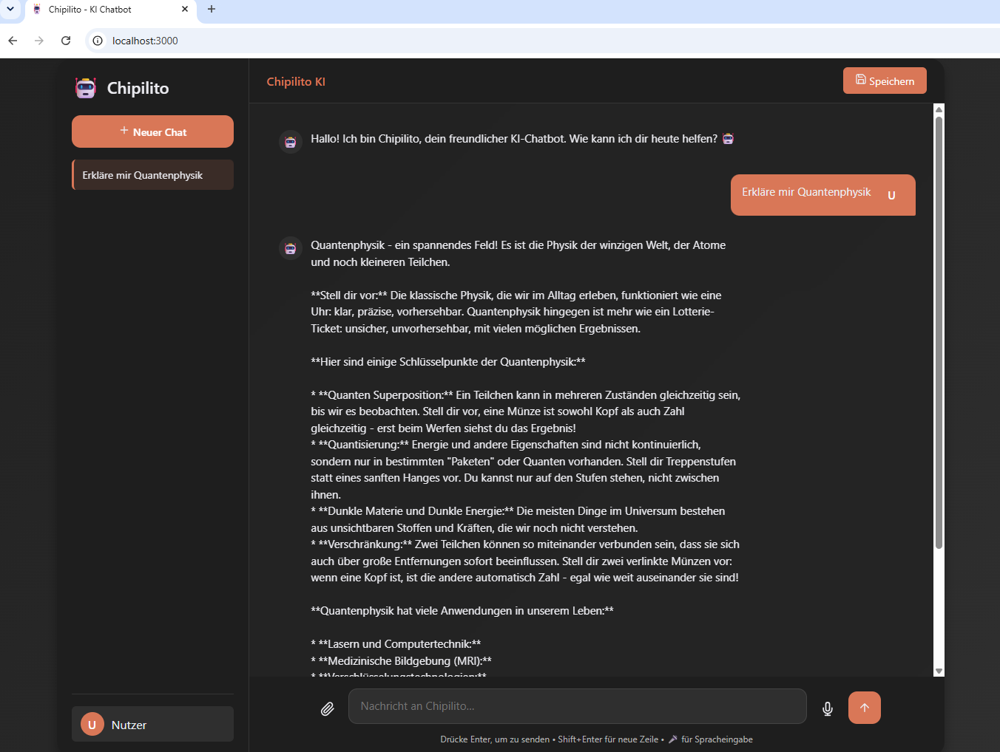

<div align="center">

# 🤖 Chipilito

**Ein schlanker, offline-fähiger KI-Chatbot mit lokaler Benutzerverwaltung**


</div>

---

## ✨ Features

| | |
|---|---|
| 💬 | Chat mit **Ollama** (lokal) oder **Google Gemini** (Cloud) |
| 📎 | Dateianalyse: **PDF**, **Word (.docx)**, **Excel (.xlsx)**, reine Textdateien |
| 🔐 | Benutzerkonten mit Passwort-Hashing (bcrypt) & API-Key-Authentifizierung, Chats pro Konto getrennt |
| 🗄️ | Persistenz über eine lokale SQLite-Datenbank (`better-sqlite3`) – keine externe DB nötig |
| ⚡ | Gestreamte Antworten für ein flüssiges Chat-Gefühl |
| 🎙️ | Optionale Spracheingabe (Web Speech API, browserabhängig) |

---

## 🖥️ Hardware-Anforderungen

Der Node.js-Server selbst ist sehr genügsam – der eigentliche Ressourcenbedarf hängt fast vollständig davon ab, **welches KI-Modell** du verwendest. Nutzt du die Gemini-Cloud-API, reicht praktisch jeder moderne PC ohne dedizierte GPU. Willst du komplett offline mit Ollama arbeiten, entscheidet primär RAM bzw. **VRAM der Grafikkarte** über die Antwortgeschwindigkeit.

### Minimum – Basis-Server (nur Cloud-Modus, `CHATLITE_PROVIDER=gemini`)

| Komponente | Minimum | Empfohlen |
|---|---|---|
| **OS** | Windows 10+, macOS 12+, Linux (Ubuntu 20.04+) | aktuelle Version |
| **CPU** | Dual-Core x64, 2 GHz+ | Quad-Core |
| **RAM** | 2 GB | 4 GB |
| **GPU** | keine nötig | keine nötig |
| **Speicherplatz** | 500 MB | 1 GB |
| **Node.js** | 18.0.0+ | 20 LTS |
| **Internet** | erforderlich | stabile Verbindung |

### Minimum – lokaler Betrieb mit Ollama

Sprachmodelle werden komplett in RAM (CPU-Modus) oder VRAM (GPU-Modus) geladen. Faustregel bei 4-Bit-Quantisierung (Ollama-Standard): **≈ 0,7–1 GB Speicher pro Milliarde Parameter**, zzgl. Kontext-Overhead. Eine GPU ist nicht zwingend erforderlich, beschleunigt die Ausgabe aber um ein Vielfaches.

| Modell (Ollama-Tag) | Parameter | Downloadgröße (≈) | Minimum RAM | Empfohlene GPU (VRAM) | Tokens/Sek. (ca.) |
|---|---|---|---|---|---|
| `gemma2:2b` | 2B | ~1,6 GB | 4 GB RAM | ohne GPU nutzbar | 5–15 (CPU) |
| `llama3.2:3b` | 3B | ~2,0 GB | 4 GB RAM | ohne GPU nutzbar | 5–15 (CPU) |
| `gemma2` / `gemma2:9b` *(Standard)* | 9B | ~5,4 GB | 8 GB RAM | 8 GB VRAM (z. B. RTX 3060/4060) | 2–8 (CPU) / 30+ (GPU) |
| `llama3.1:8b` | 8B | ~4,7 GB | 8 GB RAM | 8 GB VRAM | 2–8 (CPU) / 30+ (GPU) |
| `gemma2:27b` | 27B | ~16 GB | 24 GB RAM | 24 GB VRAM (z. B. RTX 4090) | nicht empfohlen (CPU) / 15–25 (GPU) |

> ⚠️ Alle Angaben sind Richtwerte und hängen von Kontextlänge, Quantisierung, Ollama-Version und Hintergrundlast ab. Ohne GPU läuft **jedes** Modell rein auf der CPU, größere Modelle (9B+) fühlen sich dabei aber spürbar zäh an – für flüssige Echtzeit-Antworten wird ab dem Standardmodell (`gemma2`, 9B) eine dedizierte GPU mit mindestens 8 GB VRAM empfohlen.

### Welche Konfiguration passt zu mir?

| Szenario | Empfehlung |
|---|---|
| 🌐 Immer online, gelegentlich chatten | `CHATLITE_PROVIDER=gemini` – keine GPU, minimale Hardwareanforderungen |
| 💻 Alter/schwacher Laptop, offline | Ollama mit `gemma2:2b` oder `llama3.2:3b`, CPU reicht |
| 🖥️ Normaler Desktop/Laptop ohne GPU | Ollama mit Standardmodell `gemma2` (9B) im CPU-Modus – funktioniert, aber langsamer |
| 🎮 Dedizierte GPU vorhanden (ab 8 GB VRAM) | `gemma2:9b` oder `llama3.1:8b` läuft flüssig in Echtzeit |
| 🏢 Workstation mit High-End-GPU (24 GB+ VRAM) | `gemma2:27b` für spürbar bessere Antwortqualität |

**Zusätzlicher Speicherplatz** für Datei-Uploads/PDF-Verarbeitung ist normalerweise vernachlässigbar (Standard-Limit: `MAX_FILE_SIZE=5MB` pro Datei, siehe `.env`), sollte aber bei intensiver Nutzung mit einkalkuliert werden.

---

## 🚀 Schnellstart

```bash
git clone https://github.com/noeljoan/chipilito.git
cd chipilito
npm install
cp .env.example .env   # Werte nach Bedarf anpassen
npm start
```

Der Server läuft anschließend unter **http://localhost:3000**.

Für lokale Modelle zusätzlich [Ollama installieren](https://ollama.com) und das gewünschte Modell einmal vorab laden:

```bash
ollama pull gemma2
ollama serve
```
## 🖼️ Screenshot



---

## ⚙️ Konfiguration (`.env`)

| Variable | Beschreibung | Standard |
|---|---|---|
| `CHATLITE_PROVIDER` | `ollama` oder `gemini` | `ollama` |
| `OLLAMA_URL` | Adresse des lokalen Ollama-Servers | `http://localhost:11434` |
| `OLLAMA_MODEL` | Zu verwendendes Ollama-Modell | `gemma2` |
| `GEMINI_API_KEY` | API-Key für Google Gemini (nur bei `CHATLITE_PROVIDER=gemini`) | – |
| `PORT` | Server-Port | `3000` |
| `MAX_FILE_SIZE` | Max. Uploadgröße pro Datei in Bytes | `5242880` (5 MB) |

> ℹ️ `LM_STUDIO_URL` ist in der `.env` als Platzhalter vorhanden; die eigentliche Routing-Logik für LM Studio als eigenständigen Provider ist im aktuellen `server.js` noch **nicht** implementiert (Anfragen mit `CHATLITE_PROVIDER=lmstudio` landen derzeit beim Ollama-Pfad). Wer LM Studio nutzen will, sollte vorerst dessen Ollama-kompatible API unter `OLLAMA_URL` eintragen.

---

## 🔐 Authentifizierung / API

| Endpoint | Methode | Beschreibung |
|---|---|---|
| `/api/auth/register` | `POST` `{ name, password }` | Konto anlegen → liefert `api_key` |
| `/api/auth/login` | `POST` `{ name, password }` | Login → liefert `api_key` |
| `/api/auth/profile` | `GET` (Header `x-api-key`) | Profil abrufen |
| `/api/auth/profile` | `PUT` (Header `x-api-key`, Body `{ name }`) | Anzeigename ändern |
| `/api/chat` | `POST` `{ messages }` | Chat-Anfrage, Antwort als gestreamter Text |

Der Login ist optional – ohne Konto kann man als Gast weiterchatten. Chats werden pro Konto (bzw. für Gäste separat) im Browser gespeichert.

---

## 🌍 Mehrsprachigkeit

Die Oberfläche gibt es komplett auf **Deutsch, Englisch, Französisch und Spanisch** – umschaltbar über den kleinen Sprachwähler oben in der Sidebar (🇩🇪 🇬🇧 🇫🇷 🇪🇸).

- Übersetzt werden alle Buttons, Platzhalter, Tooltips, die Login/Registrieren-Maske, Fehler-/Bestätigungsmeldungen sowie die **Willkommensnachricht** beim Start eines neuen Chats.
- Die Wahl wird im Browser gespeichert (`localStorage`) und beim nächsten Besuch automatisch wieder geladen; ohne vorherige Auswahl wird die Browsersprache erkannt (Fallback: Deutsch).
- Markenname ("Chipilito") sowie die Widmung in der Kopfzeile bleiben unabhängig von der gewählten Sprache unverändert.

---

## 🗺️ Projektstruktur

```
chipilito/
├── server.js        # Hauptserver (Auth, Chat-Routing, Datei-Extraktion)
├── db.js            # SQLite-Benutzerverwaltung (better-sqlite3)
├── public/
│   ├── index.html   # UI
│   ├── styles.css
│   └── app.js        # Frontend-Logik (Chat, Auth-Modal, Dateiupload)
└── .env              # Konfiguration
```

---
## 📄 Lizenz

Dieses Projekt ist unter der MIT-Lizenz lizenziert. Siehe die [LICENSE](LICENSE)-Datei für Details.

---

## 👥 Mitwirken & Support

Beiträge, Fehlerberichte und Feature-Anfragen sind herzlich willkommen! Erstelle dazu einfach ein Issue oder einen Pull Request.

*Copyright (C) Noel Joan - 2026. Alle Rechte vorbehalten.*
