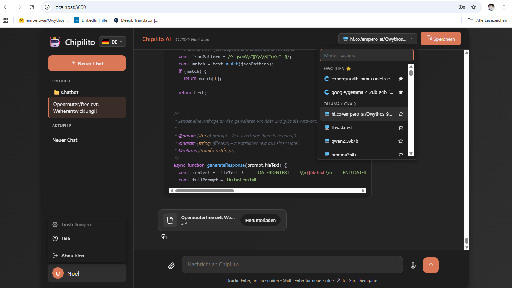

<div align="center">

# 🐟 Chipilito

**Ein schlanker, selbstgehosteter KI-Chatbot für Node.js** – läuft komplett
lokal mit [Ollama](https://ollama.com), mit Google Gemini oder mit jedem
OpenAI-kompatiblen Anbieter (z. B. [OpenRouter](https://openrouter.ai), LM
Studio, Groq). Kein Framework-Overhead, keine externe Datenbank, kein
Frontend-Build – nur Node.js, SQLite und ein einziger Server-Prozess.

<p>
  
  
  
  
</p>
</div>
---

## Inhaltsverzeichnis

- [Features](#-features)
- [Schnellstart](#-schnellstart)
- [Konfiguration](#️-konfiguration-env)
- [Docker](#-docker)
- [Fernzugriff (ngrok)](#-fernzugriff-optional)
- [Projektstruktur](#️-projektstruktur)
- [Eigene KI-Anbieter als Plugin](#-eigene-ki-anbieter-als-plugin)
- [API-Übersicht](#-api-übersicht)
- [Tech-Stack](#️-tech-stack)
- [Sicherheit](#-sicherheit)
- [Lizenz & Changelog](#-lizenz)

---

## ✨ Features

**KI & Anbieter**
- 💬 **Mehrere KI-Anbieter** – Ollama (lokal), Google Gemini oder ein beliebiger
  OpenAI-kompatibler Endpoint, jederzeit im Modell-Umschalter wechselbar.
  Modelle lassen sich mit ⭐ favorisieren (kontogebunden gespeichert).
- 🔌 **Plugin-System für KI-Anbieter** – neue Anbieter lassen sich per Datei in
  `plugins/providers/` hinzufügen, ganz ohne Änderung am Kern-Code (siehe
  Abschnitt weiter unten). Ein funktionierendes Beispiel (Anthropic Claude)
  liegt bereits bei.
- 🖼️ **Bildanalyse (Vision)** – Bilder lassen sich direkt an Ollama- oder
  Gemini-Modelle mit Vision-Unterstützung anhängen und werden vom Modell
  ausgewertet.
- 🛡️ **Schutz gegen Prompt-Injection** – Inhalte aus hochgeladenen Dateien
  werden dem Modell mit einer expliziten Warnung übergeben, damit darin
  enthaltene Anweisungen nicht versehentlich befolgt werden.

**Chat & Organisation**
- 📌 **Chat-Verwaltung** – Anheften, Umbenennen, Löschen und Gruppieren von
  Chats in **Projekte** über ein ⋮-Kontextmenü.
- 📁 **Projekte** – Chats lassen sich Projekten zuordnen (und wieder
  entfernen); Projekte selbst können umbenannt oder gelöscht werden, ohne
  dass zugeordnete Chats verloren gehen.
- 🔍 **Volltextsuche** über alle Chats (Titel + Nachrichteninhalt).
- 🏷️ **Automatischer Chat-Titel** per KI nach der ersten Nachricht.
- 👁️ **Markdown-Live-Vorschau** beim Schreiben einer Nachricht.
- 🎤 **Spracheingabe** über die Web Speech API des Browsers.
- 🌍 **Mehrsprachig** – Deutsch, Englisch, Französisch, Spanisch.

**Dateien & Export**
- 📎 **Datei-Uploads** per Klick oder **Drag & Drop**. Unterstützt PDF, Word
  (.docx), Excel und Bilder.
- 📄 **Export** – Antworten lassen sich als PDF, Word oder Excel exportieren.
- 📦 **ZIP-Download für Mehrdatei-Antworten** – enthält eine Antwort mehrere
  Code-Blöcke, bietet die App automatisch eine gebündelte ZIP-Datei zum
  Download an, inkl. automatischer Dateinamen-Erkennung.
- ⬇️ **Einzel-Download & Syntax-Highlighting mit Zeilennummern** für jeden
  Code-Block.

**Konten & Betrieb**
- 🔐 **Eigene Konten** – einfache Benutzerverwaltung (Name + Passwort) mit
  kontoübergreifender Chat-Synchronisierung über SQLite.
- 💾 **Automatische Datenbank-Backups** (rotierend, konfigurierbares
  Intervall, sicheres Online-Backup via better-sqlite3).
- 🐳 **Docker-ready** – inkl. `docker-compose.yml` mit optionalem
  Ollama-Container.

---

## 📸 Screenshot




---

## 🚀 Schnellstart

### Voraussetzungen

- [Node.js](https://nodejs.org) ≥ 18
- Optional: [Ollama](https://ollama.com) für lokale Modelle, oder ein API-Key
  für Gemini/OpenRouter

### Installation

```bash
git clone <dein-repo-url>
cd chipilito
npm install
cp .env.example .env   # Werte nach Bedarf anpassen (siehe unten)
npm start
```

Die App läuft danach unter **http://localhost:3000**.

### Entwicklung (Auto-Reload)

```bash
npm run dev
```

---

## ⚙️ Konfiguration (`.env`)

| Variable | Beschreibung | Default |
|---|---|---|
| `CHATLITE_PROVIDER` | `ollama`, `gemini` oder `openai_compatible` | `ollama` |
| `OLLAMA_URL` | URL des Ollama-Servers | `http://localhost:11434` |
| `OLLAMA_MODEL` | Standard-Ollama-Modell | `gemma2` |
| `OLLAMA_NUM_CTX` | Kontextfenster-Größe für Ollama | `21586` |
| `GEMINI_API_KEY` | API-Key für Google Gemini | – |
| `GEMINI_MODEL` | Standardmodell für Gemini | `gemini-2.0-flash` |
| `OPENAI_COMPATIBLE_URL` | Basis-URL des OpenAI-kompatiblen Anbieters | – |
| `OPENAI_COMPATIBLE_API_KEY` | API-Key dafür | – |
| `OPENAI_COMPATIBLE_MODEL` | Standardmodell dafür | – |
| `PORT` | Server-Port | `3000` |
| `DB_PATH` | Pfad zur SQLite-Datei (relativ wird relativ zum Projektordner aufgelöst) | `./chipilito.db` |
| `BACKUP_DIR` | Ordner für automatische DB-Backups (relativ = zum Projektordner) | `./backups` |
| `BACKUP_MAX_COUNT` | Wie viele Backups aufbewahrt werden | `14` |
| `BACKUP_INTERVAL_HOURS` | Intervall zwischen automatischen Backups (h) | `24` |
| `MAX_FILE_SIZE` | Maximale Upload-Größe in Bytes | `5242880` (5 MB) |

Eine vollständige Vorlage liegt in [`.env.example`](.env.example).

> **Modellwahl im laufenden Betrieb:** Der `CHATLITE_PROVIDER` in der `.env`
> setzt nur den *Standard*. Im Modell-Umschalter der App kann jederzeit
> zwischen allen konfigurierten Anbietern und Modellen gewechselt werden
> (inkl. Live-Abfrage aller verfügbaren Modelle beim OpenAI-kompatiblen
> Anbieter, z. B. der komplette OpenRouter-Katalog).

---

## 🐳 Docker

```bash
docker compose up -d
```

Startet Chipilito **und** einen lokalen Ollama-Container. Daten (SQLite-DB,
Ollama-Modelle) liegen in benannten Docker-Volumes und überleben Neustarts.
Für NVIDIA-GPU-Beschleunigung von Ollama die entsprechenden Zeilen in
`docker-compose.yml` einkommentieren.

Nur die App ohne Compose bauen:

```bash
docker build -t chipilito .
docker run -p 3000:3000 -v chipilito_data:/app/data chipilito
```

Das Image nutzt einen zweistufigen Build (`node:20-bookworm-slim`), da
`better-sqlite3` ein natives Modul enthält, das gegen die Ziel-Plattform
kompiliert werden muss.

---

## 🌐 Fernzugriff (optional)

Für einen schnellen, temporären Zugriff von außen (ohne eigenes Hosting)
eignet sich ein Tunnel-Dienst wie [ngrok](https://ngrok.com). Eine Beispiel-
Traffic-Policy liegt in [`policy.yaml`](policy.yaml) und zeigt, wie sich der
Zugriff zusätzlich per Google-OAuth auf eine bestimmte Domain einschränken
lässt – als Ausgangspunkt für eigene Anpassungen gedacht, nicht als
Produktions-Setup.

---

## 🗂️ Projektstruktur

```
chipilito/
├── server.js               # Dünner Einstiegspunkt: erstellt den HTTP-Server,
│                            # verdrahtet die Routen-Module
├── server/
│   ├── config.js            # Zentrale Konfiguration (liest .env)
│   ├── http-utils.js        # readJsonBody, sendJson, serveStatic, ...
│   ├── router.js            # Schlanker Routen-Matcher (kein Express)
│   ├── file-extraction.js   # PDF/Word/Excel/ZIP-Textextraktion für Uploads
│   ├── backup.js            # Automatische DB-Backups
│   ├── providers/
│   │   ├── registry.js       # Plugin-Registry (Kern des Provider-Systems)
│   │   ├── loadPlugins.js    # Lädt plugins/providers/*.js dynamisch
│   │   ├── index.js          # Importiert die eingebauten Anbieter
│   │   └── ollama.js, gemini.js, openaiCompatible.js
│   └── routes/
│       ├── auth.js, models.js, chats.js, projects.js
│       ├── favorites.js, chat-completion.js, chat-title.js
│       └── export.js, backup.js
├── plugins/
│   └── providers/            # Eigene KI-Anbieter-Plugins (siehe unten)
│       └── anthropic.example.js
├── db.js                    # SQLite-Zugriff (Nutzer, Chats, Projekte, Favoriten)
├── export.js                 # PDF/Word/Excel-Dokumentengenerierung
├── public/
│   ├── index.html
│   ├── app.js                # Gesamte Frontend-Logik (kein Build-Schritt nötig)
│   └── styles.css
├── .env.example
├── Dockerfile
├── docker-compose.yml
├── policy.yaml               # Beispiel-Zugriffsrichtlinie für ngrok
└── CHANGELOG.md
```

Kein Bundler, kein Build-Schritt fürs Frontend – `public/` wird direkt vom
Server ausgeliefert. Das Backend ist in kleine, fokussierte Module aufgeteilt
statt einer einzigen großen `server.js`.

---

## 🧩 Eigene KI-Anbieter als Plugin

Neue KI-Anbieter lassen sich hinzufügen, ohne `server/` anzufassen: einfach
eine `.js`-Datei in `plugins/providers/` ablegen, die beim Laden
`registerProvider(...)` aufruft:

```js
// plugins/providers/mein-anbieter.js
import { registerProvider } from '../../server/providers/registry.js';
import { normalizeMessages } from '../../server/file-extraction.js';
import { buildSystemPrompt } from '../../server/config.js';

registerProvider({
  id: 'mein-anbieter',            // eindeutiger Schlüssel
  label: 'Mein Anbieter',         // Anzeigename im Modell-Umschalter
  icon: '🔧',                     // optional
  configured: () => Boolean(process.env.MEIN_ANBIETER_API_KEY),
  listModels: async () => [],     // optional: Modelle beim Anbieter live abfragen
  defaultModel: 'irgendein-modell',
  async complete(body, clientSignal) {
    // WICHTIG: normalizeMessages() extrahiert Datei-/ZIP-Anhänge als Text,
    // buildSystemPrompt() liefert u. a. den Schutz gegen Prompt-Injection
    // über Datei-Inhalte - beides sollte jedes Plugin nutzen.
    const messages = await normalizeMessages(body.messages);
    // ... eigenen API-Aufruf bauen, Streaming-Response als
    // `new Response(readableStream, { headers: {...} })` zurückgeben ...
  }
});
```

Ein vollständiges, funktionierendes Beispiel (Anthropic Claude über die
native Messages API) liegt in
[`plugins/providers/anthropic.example.js`](plugins/providers/anthropic.example.js) –
Datei zu `anthropic.js` umbenennen und `ANTHROPIC_API_KEY` setzen, um es zu
aktivieren. Dateien mit der Endung `.example.js` werden absichtlich **nicht**
automatisch geladen.

---

## 🔌 API-Übersicht

Alle Endpoints erwarten (außer Auth) den Header `x-api-key` mit dem beim
Login erhaltenen Schlüssel.

| Methode | Pfad | Zweck |
|---|---|---|
| `POST` | `/api/auth/register` / `/api/auth/login` | Konto anlegen / einloggen |
| `GET`/`PUT` | `/api/auth/profile` | Profil lesen / Namen ändern |
| `GET` | `/api/models` | Verfügbare Modelle je Anbieter |
| `POST` | `/api/chat` | Nachricht senden (Streaming-Antwort) |
| `GET` | `/api/chats` | Chats des Kontos laden |
| `GET`/`PUT`/`DELETE` | `/api/chats/:id` | Chat laden/speichern/löschen |
| `PUT` | `/api/chats/:id/pin` \| `/rename` | Chat anheften / umbenennen |
| `POST` | `/api/chats/:id/addToProject` | Projekt zuordnen (`project_id: null` entfernt) |
| `POST` | `/api/chats/:id/generateTitle` | Kurzen Chat-Titel per KI generieren |
| `GET`/`POST` | `/api/zumProjects` | Projekte auflisten / anlegen |
| `PUT`/`DELETE` | `/api/zumProjects/:id` | Projekt umbenennen / löschen |
| `GET`/`PUT` | `/api/favorites` | Favorisierte Modelle laden / speichern |
| `POST` | `/api/export` | Antwort als PDF/Word/Excel exportieren |
| `GET`/`POST` | `/api/backups` | DB-Backups auflisten / manuell auslösen |

---

## 🛠️ Tech-Stack

- **Backend:** Node.js (ESM), reines `http`-Modul (kein Express im
  Request-Pfad), [better-sqlite3](https://github.com/WiseLibs/better-sqlite3)
- **Frontend:** Vanilla JS, kein Framework, [highlight.js](https://highlightjs.org)
  für Syntax-Highlighting, [JSZip](https://stuk.github.io/jszip/) für
  ZIP-Downloads
- **Export:** [pdfkit](https://pdfkit.org), [docx](https://docx.js.org),
  [exceljs](https://github.com/exceljs/exceljs)
- **Datei-Parsing:** [pdf-parse](https://www.npmjs.com/package/pdf-parse),
  [mammoth](https://github.com/mwilliamson/mammoth.js) (Word),
  [adm-zip](https://github.com/cthackers/adm-zip)
- **Auth:** [bcryptjs](https://github.com/dcodeIO/bcrypt.js) für
  Passwort-Hashing, API-Key-basierte Authentifizierung

---

## 🔒 Sicherheit

- Passwörter werden mit **bcrypt** gehasht, nie im Klartext gespeichert.
- Zugriff auf alle geschützten Endpoints erfolgt über einen pro Konto
  vergebenen **API-Key** (`x-api-key`-Header).
- Inhalte aus hochgeladenen Dateien/ZIP-Archiven werden dem Modell mit einer
  expliziten **Prompt-Injection-Warnung** übergeben (`buildSystemPrompt()` +
  `wrapExtractedContent()`), damit eingebettete Anweisungen in Dateiinhalten
  nicht unbeabsichtigt befolgt werden.
- Jedes Provider-Plugin sollte `normalizeMessages()` und
  `buildSystemPrompt()` nutzen, um automatisch von diesem Schutz zu
  profitieren.

---

## 📄 Lizenz

MIT – siehe [`LICENSE`](LICENSE).

## 🤝 Mitwirken

Hinweise zum lokalen Setup, Bug-Reports und Pull Requests finden sich in
[`CONTRIBUTING.md`](CONTRIBUTING.md).

## 📝 Changelog

Alle Änderungen sind in [`CHANGELOG.md`](CHANGELOG.md) dokumentiert.

## 👥 Mitwirken & Support

Beiträge, Fehlerberichte und Feature-Anfragen sind herzlich willkommen! Erstelle dazu einfach ein Issue oder einen Pull Request.

*Copyright (C) Noel Joan - 2026. Alle Rechte vorbehalten.*
